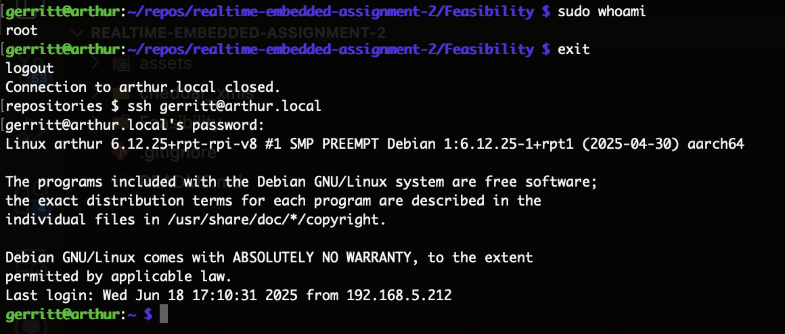

# realtime-embedded-assignment-2
Repository for the second assignment of CU Boulder's Real Time Embedded Systems course

## Problem 1

> A: Do a quick “sudo whoami” to demonstrate success for account creation.
> B: Logout and test your login, then logout. Use Alt+Print-Screen to capture your desktop and save as proof you set up your account.

Since I am running the headless version of Raspberry Pi OS I do not have access to the regular UI and instead am using SSH for the bulk of my development.  For small tweaks to the code I am using `vim` but am doing larger changes on my laptop and then sync them to the Pi either through git or via `scp`.  For more intensive projects I may install the [VSCode Remote Development Extension](https://code.visualstudio.com/docs/remote/remote-overview) so that I can code via VSCode on my laptop directly on the Pi through SSH to save time.  Below is an image showing my cusom user using `sudo` and proof of the ability to log out + log in.



> C: Make sure you can access graphical tools with MobaXterm or VNC and show that tools you may need in the future work such as editors like “geany” or “eom” (sudo apt-get install geany, or sudo apt-get install eom), a tool to display graphics in PPM or PGM format. For example, show that our class web page on Firefox (or default browser) and set your home page to https://sites.google.com/colorado.edu/ecen5623-summer. Overall, make sure you are comfortable with development, debug, compiler general native or cross-development tools and document and demonstrate that you know them.

For the most part my plan is to develop entirely headless.  I understand that the final project involves using a webcam to take pictures but if I need to view the taken pictures I will enable X-11 forwarding so that I can view the images from my laptop.

## Problem 2

> Read the paper "Architecture of the Space Shuttle Primary Avionics Software System" [available on Canvas], by Gene Carlow.

> A: Provide an explanation and critique of the frequency executive architecture.

The Shuttle PASS was divided up into 8 individual phase/functionality operational sequences (OPS) which are loaded into a mass memory module on the bus.  This is due to the fact that PASS was so large that it couldn't fit in the main memory of the flight computer.  OPS were loaded into main memory and used so that there would be no more loading during flight/safety critical moments in time. Once loaded, the OPS are managed by the Flight Computer Operating System (FCOS) that manages process/task runtime, I/O, synchronization, redundancy, etc.  Part of this operating system is a frequency executive which controls the initiation and phasing of principal functions and I/O.  A table-driven dispatching design was used to enable the phasing and sequencing of the OPS tasks to be altered between major mode changes via an update to the dispatcher table.  There were a total of 3 frequency executors running with the high priority executor at 25Hz, medium priority at 6.25Hz, and low priority at 0.25Hz.  The system was built for high repeatability but once created was difficult to change.  The difficulty to change is less of an issue as all human-rated software must go through extensive qualification and the PASS was designed to ease the process of verification.

> B: What advantages and disadvantages does the frequency executive have compared to the real-time threading and tasking implementation methods for real-time software systems? Please be specific about the advantages and disadvantages and provide at least three advantages as well as three disadvantages.

**Advantages**
1. The tasks whithin the frequency executive run with precise intervals introducing minimal jitter and leading to highly deterministic behavior.  Since all tasks use their entire execution timeslots without any preemption the tasks behave as if they were a harmonic set of tasks in RMS following the same set of task orders.
2. Since the executive is table based, the frequency of each of the tasks is easily changed/tuned based off the mission state allowing for fast reconfiguration of the software.  This is made possible by a dispatcher table update (DTU) that allows for tasks that were considered higher priority in another mission phase to be moved to the lower priority executor and vice versa.
3. Since the running tasks in the frequency executive are constrained to their time slots, the executive has a form of built in fault containment that prevents tasks in a fault state from accidentally consuming the CPU.  Any form of an overrun in a task is ended at the end of that tasks time slot whereas in an RTOS an overrun could bleed over into the window of other tasks causing a cascade of failures.

**Disadvantages**
1. One of the strengths listed above can also be considered a disadvantage.  The use of a dispatcher table configured for specific mission phases allows for reconfiguration based off mission phase but it does not provide flexibility at run time.  If a new service would need to be added/ran at run time, it would be cumbersome or even impossible to pull off in a verified way.
2. Since the frequency executive is not interrupt based, asynchronous events are only processed when the responsible task is ran.  This means asynchronous events may not be serviced for a while if the responsible task isn't constantly polling/checkign for the event.
3. The architecture relies on a lot of up front analysis to verify the funcitonality and feasibility of every configuration of the dispatcher table.  Especially to end up with deterministic and highly repeatable behavior, the software must go through verification during the concept, design, and development phases at a higher level.

## Problem 3

> Download feasibility example code and build it on your Raspberry Pi or alternate system of your choice and execute the code. Note that the C code already implements the RM LUB and RM exact feasibility analysis using scheduling point and completion test methods, but we have not studied methods to automate EDF or LLF feasibility beyond hand analysis methods, so for EDF and LLF, rely upon Cheddar and your hand analysis.

> A: Compare the tests provided to analysis using Cheddar for the first 4 examples tested by the code.

For the first code example provided in the original `feasibility_tests.c` file, we have a set of services, `S1`, `S2`, and `S3` with the following settings: `C1=1, C2=1, C3=2; T1=2, T2=10, T3=15; T=D`.  The provided output from the test program is:

```c
******** Completion Test Feasibility Example
Ex-0 U=73.33% (C1=1, C2=1, C3=2; T1=2, T2=10, T3=15; T=D): CT test FEASIBLE
for 3, utility_sum = 0.000000
for 0, wcet=1.000000, period=2.000000, utility_sum = 0.500000
for 1, wcet=1.000000, period=10.000000, utility_sum = 0.600000
for 2, wcet=2.000000, period=15.000000, utility_sum = 0.733333
utility_sum = 0.733333
LUB = 0.779763
RM LUB FEASIBLE

******** Scheduling Point Feasibility Example
Ex-0 U=73.33% (C1=1, C2=1, C3=2; T1=2, T2=10, T3=15; T=D): FEASIBLE
for 3, utility_sum = 0.000000
for 0, wcet=1.000000, period=2.000000, utility_sum = 0.500000
for 1, wcet=1.000000, period=10.000000, utility_sum = 0.600000
for 2, wcet=2.000000, period=15.000000, utility_sum = 0.733333
utility_sum = 0.733333
LUB = 0.779763
RM LUB FEASIBLE
```

Since the total utility of these services, `73.33%`, is less than the LUB, `77.976%`, they are schedulable.  They are also feasible due to both the Completion Test and Scheduling Point test.

Below is a screenshot of the output from running analysis using Cheddar which also calulates the LUB while performing the Completion and Scheduling Point tests.  The cheddar analysis agrees with the provided tests for these services.


The second set of services is a set of 3 with the following definition: `C1=1, C2=1, C3=2; T1=2, T2=5, T3=7; T=D`.  Below is the output of the second set:

```c
******** Completion Test Feasibility Example
Ex-1 U=98.57% (C1=1, C2=1, C3=2; T1=2, T2=5, T3=7; T=D): INFEASIBLE
for 3, utility_sum = 0.000000
for 0, wcet=1.000000, period=2.000000, utility_sum = 0.500000
for 1, wcet=1.000000, period=5.000000, utility_sum = 0.700000
for 2, wcet=2.000000, period=7.000000, utility_sum = 0.985714
utility_sum = 0.985714
LUB = 0.779763
RM LUB INFEASIBLE

******** Scheduling Point Feasibility Example
Ex-1 U=98.57% (C1=1, C2=1, C3=2; T1=2, T2=5, T3=7; T=D): INFEASIBLE
for 3, utility_sum = 0.000000
for 0, wcet=1.000000, period=2.000000, utility_sum = 0.500000
for 1, wcet=1.000000, period=5.000000, utility_sum = 0.700000
for 2, wcet=2.000000, period=7.000000, utility_sum = 0.985714
utility_sum = 0.985714
LUB = 0.779763
RM LUB INFEASIBLE
```

With all three of the tests that are performed, the set of services fails all 3.  The LUB fails due to the the total utility being `98.57%` while the calculated LUB for 3 services is `77.97%`.  This alone does not mean the services are unschedulable but since the Completion and Scheduling Point tests fail as well, the examples are infeasible.

The Cheddar analysis agrees with this test as well.  It acknowledges that the utility is greater than the LUB and that it is not feasible due to the other two tests.


The third example, with the service settings `C1=1, C2=1, C3=1, C4=2; T1=2, T2=5, T3=7, T4=13; T=D`, can be found below:

```c
******** Completion Test Feasibility Example
Ex-2 U=99.67% (C1=1, C2=1, C3=1, C4=2; T1=2, T2=5, T3=7, T4=13; T=D): INFEASIBLE
for 4, utility_sum = 0.000000
for 0, wcet=1.000000, period=2.000000, utility_sum = 0.500000
for 1, wcet=1.000000, period=5.000000, utility_sum = 0.700000
for 2, wcet=1.000000, period=7.000000, utility_sum = 0.842857
for 3, wcet=2.000000, period=13.000000, utility_sum = 0.996703
utility_sum = 0.996703
LUB = 0.756828
RM LUB INFEASIBLE

******** Scheduling Point Feasibility Example
Ex-2 U=99.67% (C1=1, C2=1, C3=1, C4=2; T1=2, T2=5, T3=7, T4=13; T=D): INFEASIBLE
for 4, utility_sum = 0.000000
for 0, wcet=1.000000, period=2.000000, utility_sum = 0.500000
for 1, wcet=1.000000, period=5.000000, utility_sum = 0.700000
for 2, wcet=1.000000, period=7.000000, utility_sum = 0.842857
for 3, wcet=2.000000, period=13.000000, utility_sum = 0.996703
utility_sum = 0.996703
LUB = 0.756828
RM LUB INFEASIBLE
```

With this set of 4 services, the utility is `99.67%` which is greatly exceeding the LUB of `75.68%`.  Because of this, the other two tests must be performed which both fail for these services.

The Cheddar analysis agrees by proving that S4 will miss its deadline because its worst case response time is 16 while its deadline is 13.


For the final provided example, `C1=1, C2=2, C3=3; T1=3, T2=5, T3=15; T=D`, the outputs can be found below:

```c
******** Completion Test Feasibility Example
Ex-3 U=93.33% (C1=1, C2=2, C3=3; T1=3, T2=5, T3=15; T=D): FEASIBLE
for 3, utility_sum = 0.000000
for 0, wcet=1.000000, period=3.000000, utility_sum = 0.333333
for 1, wcet=2.000000, period=5.000000, utility_sum = 0.733333
for 2, wcet=3.000000, period=15.000000, utility_sum = 0.933333
utility_sum = 0.933333
LUB = 0.779763
RM LUB INFEASIBLE

******** Scheduling Point Feasibility Example
Ex-3 U=93.33% (C1=1, C2=2, C3=3; T1=3, T2=5, T3=15; T=D): FEASIBLE
for 3, utility_sum = 0.000000
for 0, wcet=1.000000, period=3.000000, utility_sum = 0.333333
for 1, wcet=2.000000, period=5.000000, utility_sum = 0.733333
for 2, wcet=3.000000, period=15.000000, utility_sum = 0.933333
utility_sum = 0.933333
LUB = 0.779763
RM LUB INFEASIBLE
```

Yet again, the total utility of the services, `93.33%`, is exceeding the LUB, `77.97%`, meaning they aren't guaranteed to be feasible.  After performing the Completion and  Scheduling Point tests, it is shown that the services are feasible.

Cheddar also shows that the services will never miss a deadline despite being over the LUB.


TODO:

> B: Now, implement additional examples for practice [6 more] of your interest from those that we reviewed in class (found here). Complete analysis using Cheddar RM. In cases where RM fails (fixed priority does not work), test EDF or LLF dynamic priority policies using hand analysis or Cheddar to see if either of those succeeds and if so, explain why. Cheddar uses both service simulations over the LCM of the periods as well as feasibility analysis based on the RM LUB and scheduling-point/completion-test algorithms, referred to as “Worst Case Analysis.”

The first in class example that I checked was `sched-example-0-feasible-above-LUB-disharmonic` which is a set of 3 services with the the following definition: `C1=1, C2=1, C3=2; T1=2, T2=5, T3=15; T=D`.  The services have a total utility of `83.33%` which is over the LUB of `77.976%`.  When using Cheddar to analyze the services, it shows that fixed priority is feasible despite being over the LUB and the services being disharmonic.

Below is the output of the feasiblity tests and a capture of the cheddar analysis for fixed priority:

```c
******** Completion Test Feasibility Example
sched-example-0-feasible-above-LUB-disharmonic
U=83.33% (C1=1, C2=1, C3=2; T1=2, T2=5, T3=15; T=D): FEASIBLE
for 3, utility_sum = 0.000000
for 0, wcet=1.000000, period=2.000000, utility_sum = 0.500000
for 1, wcet=1.000000, period=5.000000, utility_sum = 0.700000
for 2, wcet=2.000000, period=15.000000, utility_sum = 0.833333
utility_sum = 0.833333
LUB = 0.779763
RM LUB INFEASIBLE

******** Scheduling Point Feasibility Example
sched-example-0-feasible-above-LUB-disharmonic
U=83.33% (C1=1, C2=1, C3=2; T1=2, T2=5, T3=15; T=D): FEASIBLE
for 3, utility_sum = 0.000000
for 0, wcet=1.000000, period=2.000000, utility_sum = 0.500000
for 1, wcet=1.000000, period=5.000000, utility_sum = 0.700000
for 2, wcet=2.000000, period=15.000000, utility_sum = 0.833333
utility_sum = 0.833333
LUB = 0.779763
RM LUB INFEASIBLE
```


It can be seen in the Cheddar output that the worst case response time for all of the services is less than or equal to all of the periods of the services meaning they are feasible.

The second set of services that I chose to analyze is the `sched-example-3-above-LUB-harmonic` set with the following settings: `C1=1, C2=2, C3=3; T1=3, T2=5, T3=15; T=D`.  The utility of the services, `93.33%`, is above the LUB for a set of 3 services, `77.97%`.  When performing worst case analysis, it can be seen that the services are still feasible despite being over the LUB.  The output can be seen here:

```c
******** Completion Test Feasibility Example
sched-example-3-above-LUB-harmonic
U=93.33% (C1=1, C2=2, C3=3; T1=3, T2=5, T3=15; T=D): FEASIBLE
for 3, utility_sum = 0.000000
for 0, wcet=1.000000, period=3.000000, utility_sum = 0.333333
for 1, wcet=2.000000, period=5.000000, utility_sum = 0.733333
for 2, wcet=3.000000, period=15.000000, utility_sum = 0.933333
utility_sum = 0.933333
LUB = 0.779763
RM LUB INFEASIBLE

******** Scheduling Point Feasibility Example
sched-example-3-above-LUB-harmonic
U=93.33% (C1=1, C2=1, C3=2; T1=2, T2=5, T3=15; T=D): FEASIBLE
for 3, utility_sum = 0.000000
for 0, wcet=1.000000, period=3.000000, utility_sum = 0.333333
for 1, wcet=2.000000, period=5.000000, utility_sum = 0.733333
for 2, wcet=3.000000, period=15.000000, utility_sum = 0.933333
utility_sum = 0.933333
LUB = 0.779763
RM LUB INFEASIBLE
```

The Cheddar analysis agrees with the tests which is seen here:


The third example that I picked was `sched-example-5-2-above-LUB-harmonic-OVERLOAD` which is an example of overloading the CPU.  The services are defined with `C1=1, C2=1, C3=2; T1=2, T2=5, T3=15; T=D` which has a total utility of `120%`.  Because of this overload of the CPU, fixed priority will always fail to schedule the tasks.  Unfortunately, dynamic priority scheduling will also fail because it is unable to schedule any set of services with a utility > 100%.  Below is the cheddar output for fixed priority scheduling.  All scheduling methods fail due to the over 100% utility:


The fourth example that I picked was `sched-example-7-1-above-LUB-harmonic-EDF-and-LLF-difference` with services defined with: `C1=1, C2=1, C3=2; T1=2, T2=5, T3=15; T=D`.  This is an example of where RM can pass despite having a 100% utility.  This is also an example of how LLF and EDF can have a different order of task execution.  The LUB is `77.97%` while the total utility of the services is 100%.  The testing output and Cheddar analysis can be found below for fixed priority showing that despite failing the LUB check, the tasks are schedulable:

```c
******** Completion Test Feasibility Example
sched-example-7-1-above-LUB-harmonic-EDF-and-LLF-difference
U=100.00% (C1=1, C2=2, C3=4; T1=3, T2=5, T3=15; T=D): FEASIBLE
for 3, utility_sum = 0.000000
for 0, wcet=1.000000, period=3.000000, utility_sum = 0.333333
for 1, wcet=2.000000, period=5.000000, utility_sum = 0.733333
for 2, wcet=4.000000, period=15.000000, utility_sum = 1.000000
utility_sum = 1.000000
LUB = 0.779763
RM LUB INFEASIBLE

******** Scheduling Point Feasibility Example
sched-example-7-1-above-LUB-harmonic-EDF-and-LLF-difference
U=100.00% (C1=1, C2=1, C3=2; T1=2, T2=5, T3=15; T=D): FEASIBLE
for 3, utility_sum = 0.000000
for 0, wcet=1.000000, period=3.000000, utility_sum = 0.333333
for 1, wcet=2.000000, period=5.000000, utility_sum = 0.733333
for 2, wcet=4.000000, period=15.000000, utility_sum = 1.000000
utility_sum = 1.000000
LUB = 0.779763
RM LUB INFEASIBLE
```


EDF and LLF diverge at the 12th time slice when S3 having a lower Laxity than S2 causes it to preempt S2.  It causes a new sequence of execution for the remainder of the LCM and can be seen below:


For the fifth example I picked I chose `sched-example-9-above-LUB-harmonic` which defines 4 tasks as such: `C1=1, C2=2, C3=4, C4=6; T1=6, T2=8, T3=12, T4=24; T=D`.  The total utility of the tasks is `100%` while the LUB is `75.68%`.  When running the test

# TODO: FIX ME I USED THE WRONG VALUE

# TODO: REPLACE LAST TEST WITH ONE THAT FAILS RM BUT NOT EDF OR LLF

> C: Does your modified feasibility code agree with Cheddar analysis for additional cases? Why or why not?

TODO:

> Read Chapter 3 of the textbook.

> A: Provide 3 constraints that are made in the RM LUB derivation and 3 assumptions as documented in the Liu and Layland paper and in Chapter 3 of RTECS with Linux and RTOS. Describe whether you think each is reasonable for actual practice or whether you think each is only applicable to an idealized model of practice

- Assumptions
  - All services requested on periodic basis, the period is constant
    - This assumption is very reasonable for some a mathematical verification formula/conservative check.  For the majority of embedded software that I have worked on the work is fairly periodic aside from some interrupt processing so this is applicable.
  - Completion-time < period
    - This assumption is the basis of realtime software verification.  We have X amount of work that must be completed in Y amount of time on a periodic basis.  If it ever runs long we will lose the real time status and possibly lose property or life.
  - Runtime is known and deterministic (WCET may be used)
    - This seems to be more of the idealized model.  The frequencies of the bus can change depending on environmental factors, interrupts can fire at times that are unexpected, and runtime constraints can be far from ideal.
- Constraints
  - Deadline = period by definition
    - This once again makes sense due to the desire to validate the absolute worst case of the software.  The deadline must be the period in the software model so that if the runtime of that service is equal to its period, it is still within its deadline.
  - Fixed-priority, preemptive, run-to-completion scheduling
    - Once again this is understandable.  The LUB is a very basic check that is used as a first check.  It cannot be used in a more complex manner testing out dynamic priority like EDF or LLF.

> B: Finally, list three key derivation steps in the RM LUB derivation that you either do not understand or that you would consider “tricky” math. Attempt to describe the rationale for those steps as best you can do based upon reading in Chapter 3 of RTECS with Linux and RTOS.

1. Step 3.1 is a little tricky but I believe I am understanding it.  What this step is saying is that the execution time of S1 must be less than or equal to the difference between period of T2 and amount of time that T1 can be active during the period of T2.  If this wasn't the case, then S1 would be consuming too much of the CPU and would be starving S2 leading to missed deadlines.
2. The steps to get to equation 3.5 are definitely a little tricky.  They require having already solved for C2 with equation 2 but it isn't shown how that is achieved.  If you use equation 3 to solve for C2 you will end up with a different looking equation. The algebraic steps to go from 3.4 to 3.5 are definitely hard if you haven't done algebra in a while but it is solvable.
3. Step 3.12 is some fairly extensive algebra that needs to be done.  It requires solving for both C1 and C2 in previous steps based off the assumptions and constraints made.  It makes sense that you want to solve down to as few of variables as possible to simplify the equation but what confuses me on it is how do you go from 3.12 to 3.13 where the `f` variable is defined.  I am unsure how the assumption is made that `f` is the value that is given to it.